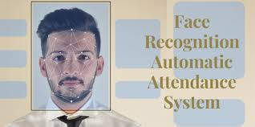

# Face-Recognition-Attendance-System

## Recognize The faces and Mark Atteandance Automatic.

## Introduction
The main purpose of this project is to build a face recognition-based attendance monitoring system for educational institution to enhance and upgrade the current attendance system into more efficient and effective manner as compared to before. 
The manual attendance system has a lot of problems that caused inaccuracy in attendance taking. Many problems arise when the authority is unable to enforce the regulation that exist in the old system. The technology working behind will be the face recognition system. The human face is one of the natural traits that can be uniquely identify an individual.

## Definition
A facial recognition is  a  computer  application for automatically identifying or verifying a person from a digital image or a video frame from a video source.
## Motivation
The main motivation for the project was the slow and inefficient traditional manual attentdance system. So why not make it automated fast and much efficiently. Also such face detection techniques are in use by many departments.
## Features
* Check Camera.  
* Capture Images.  
* Training Images.    
* Recognize Images and Mark Attendance.

## Requirements
### Software Used:
* VS Code.
* Pycharm.
### Bulid with:
* Python 3.8
### Libraries Used:
* OpvenCV(`pip install opencv-python`).    
* Numpy(`pip install numpy`).      
* Face_Recognition(`pip install face-recognition`).     
* Dlib(`pip install dlib`).  
* DateTime(`pip install DateTime`).  
* Os(`Available in python`).  
* CSV(`pip install python-csv`).  

## Note
* Require High Processor.
* Noisy Image can reduce accuracy so Quality of images matter.
 

